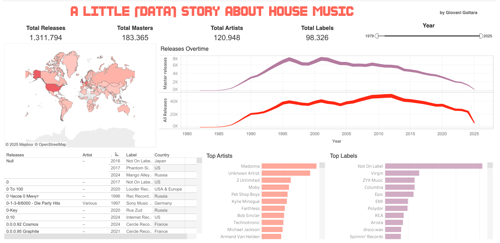

# house-music-story
A data storytelling project on house music using Discogs data and Tableau

# House Music Data Storytelling

This project explores the evolution of house music releases using data from Discogs. It features:
- Cleaned XML data parsed via Python
- Interactive Tableau dashboard with insights
- Label activity over time

## Dashboard Preview

🔗 [View the dashboard on Tableau Public](https://public.tableau.com/views/AlittledatahistoryofHouseMusic/Dashboard1?:language=en-US&publish=yes&:sid=&:display_count=n&:origin=viz_share_link)

## Repo Structure
/data                → Cleaned CSVs
/notebooks           → Colab notebooks (data prep, parsing)
/images              → Dashboard screenshots
/dashboard           → Public Tableau link
README.md            → Project summary

## Tools
- Python (pandas, xml)
- Google Colab
- Tableau Public
- Discogs XML dump

## Insights
- Surge in reissues around 2012
- Geographic spread of house music

## To come
- Most common release title words - wordcloud
- Analysis comparing titles and masters to check which masters had reissues, represses, etc.

## Author
[Giovani Goltara] – [(https://www.linkedin.com/in/giovanigoltara/)]
